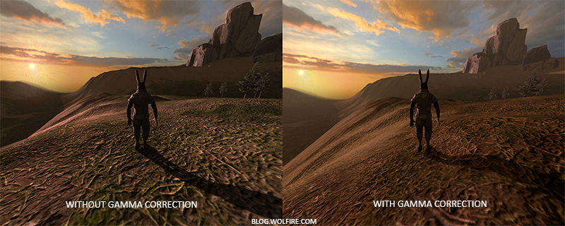

# Gamma Correction
在老式的CRT显示器上，有一种物理特性，就是如果你将输入电压提升到原来的两倍，实际上屏幕上的亮度值并不是之前的2倍，而是输入电压的2.2次幂，这个特性叫做
显示器的`Gamma`，Gamma也叫做灰度系数，注意并不是所有显示器的灰度系数都是2.2，只是对于大多数CRT来说，其灰度系数即Gamma是2.2。
而人类的眼睛所感知的亮度恰好和CRT所显示出来的指数关系相当匹配，具体见下图：


上面是人眼所感知到正常灰度色阶，下方是实际物理上的亮度色阶（指物理上发射光子的数量），由于人类的眼睛对暗部细节变化更加敏感，因此你会发现实际的物理光
亮增加一个阶段时，你看到的东西都是偏亮的，这样输出的颜色亮度会让我们的眼睛丢失很多暗部细节，然而CRT显示器的这个特性，恰好弥补了人类眼睛的这个缺陷。


如图所示，实虚线就是显示器的显示特性，纵轴为实际亮度，横轴为输入，输出为输入的2.2次幂。而我们的shader平时的颜色亮度运算都是在线性空间（RGB空间）的，
因此如果我们将一个0.5亮度的颜色增加一倍到1，我们实际上是把一个0.218亮度到东西增加到了1，放大了4.5倍多，而不是2倍。因此，我们要做的就是，将颜色最终
输出到显示器前，通过一个1/2.2次幂的曲线矫正RGB空间的颜色值，通过矫正后的颜色空间我们称作sRGB。这样，在显示器最终输出的时候，实际的亮度值就会像中间
那条直虚线一样是线性的了。如下两图所示，没有经过Gamma矫正的渲染会偏凉，丢失了很多暗部细节，而经过Gamma矫正的渲染才更加的正确。



# 矫正方式
在Opengl里通常我们有两种方式来做Gamaa矫正：
###使用Opengl内建的sRGB帧缓冲
```
glEnable(GL_FRAMEBUFFER_SRGB);
```
开启`GL_FRAMEBUFFER_SRGB`，可以告诉OpenGL每个后续的绘制命令里，在颜色储存到颜色缓冲之前先校正sRGB颜色。sRGB这个颜色空间大致对应于gamma2.2，它
也是家用设备的一个标准。但是如果你某个的shader输出并不是直接送到屏幕的，而是要做其他后处理的，那么这种方式就不太好。
###在ps的输出时手动加上Gamma矫正
```
void main()
{
    // do super fancy lighting 
    [...]
    // apply gamma correction
    float gamma = 2.2;
    fragColor.rgb = pow(fragColor.rgb, vec3(1.0/gamma));
}
```
最后一行代码，将fragColor的每个颜色元素应用有一个1.0/gamma的幂运算，校正像素着色器的颜色输出。
这个方法有个问题就是为了保持一致，你必须在每个ps里加上这个gamma校正，所以如果你有很多ps，它们可能分别用于不同物体，那么你就必须在每个ps里都加上gamma
校正了。一个更简单的方案是在你的渲染循环中引入后处理阶段，在后处理四边形上应用gamma校正，这样你只要做一次就好了。

# sRGB纹理
其实通过上面的解释我们可以知道，美术通常在制作纹理贴图时，他们是在显示器输出的颜色上编辑的，因此，他们实际上是工作在sRGB空间的，所以如果我们在渲染时应
用了这些纹理，我们一定要注意这时我们是不用进行Gamma矫正的，如果我们做了，那么就会像下图展示的一样颜色过亮，因为实际上进行了两次Gamma矫正：


因此，我们可以在使用这些纹理时把色值变回RGB线性空间
```
float gamma = 2.2;
vec3 diffuseColor = pow(texture(diffuse, texCoords).rgb, vec3(gamma));
```
为每个sRGB空间的纹理做这件事非常烦人。幸好，OpenGL给我们提供了另一个方案来解决我们的麻烦，这就是`GL_SRGB`和G`L_SRGB_ALPHA`内部纹理格式。

如果我们在OpenGL中创建了一个纹理，把它指定为以上两种sRGB纹理格式其中之一，OpenGL将自动把颜色校正到线性空间中，这样我们所使用的所有颜色值都是在线性空间中的了。
我们可以这样把一个纹理指定为一个sRGB纹理：
```
glTexImage2D(GL_TEXTURE_2D, 0, GL_SRGB, width, height, 0, GL_RGB, GL_UNSIGNED_BYTE, image);
```
如果你还打算在你的纹理中引入alpha元素，必究必须将纹理的内部格式指定为GL_SRGB_ALPHA。
因为不是所有纹理都是在sRGB空间中的所以当你把纹理指定为sRGB纹理时要格外小心。比如diffuse纹理，这种为物体上色的纹理几乎都是在sRGB空间中的。而为了获取光照参数的
纹理，像specular贴图和法线贴图几乎都在线性空间中，所以如果你把它们也配置为sRGB纹理的话，光照就坏掉了。指定sRGB纹理时要当心。

# 衰减
在使用了gamma校正之后，另一个不同之处是光照衰减(Attenuation)。真实的物理世界中，光照的衰减和光源的距离的平方成反比。
```
float attenuation = 1.0 / (distance * distance);
```
然而，当我们使用这个衰减公式的时候，衰减效果总是过于强烈，光只能照亮一小圈，看起来并不真实。出于这个原因，我们使用在基本光照教程中所讨论的那种衰减方程，它给了我们
更大的控制权，此外我们还可以使用双曲线函数：
```
float attenuation = 1.0 / distance;
```
双曲线比使用二次函数变体在不用gamma校正的时候看起来更真实，不过但我们开启gamma校正以后线性衰减看起来太弱了，符合物理的二次函数突然出现了更好的效果。下图显示了其中的不同：


这种差异产生的原因是，光的衰减方程改变了亮度值，而且屏幕上显示出来的也不是线性空间，在监视器上效果最好的衰减方程，并不是符合物理的。想想平方衰减方程，如果我们使用这个方程，而且不进行gamma校正，显示在监视器上的衰减方程实际上将变成(1.0/distance2)2.2
。若不进行gamma校正，将产生更强烈的衰减。这也解释了为什么双曲线不用gamma校正时看起来更真实，因为它实际变成了(1.0/distance)2.2=1.0/distance2.2
。这和物理公式是很相似的。